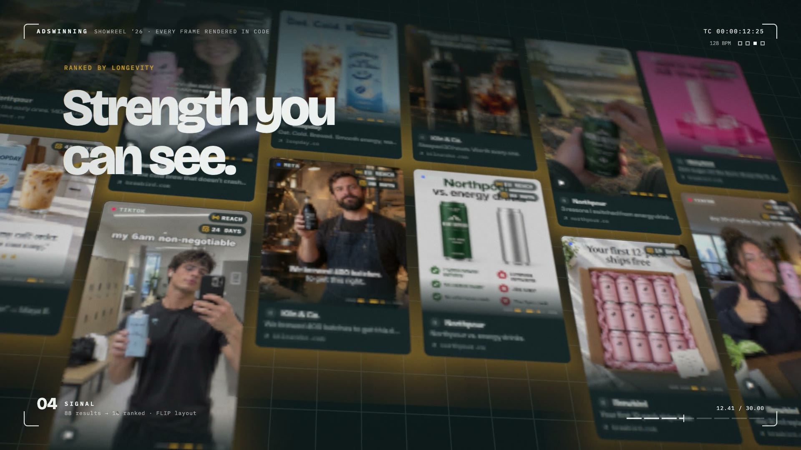
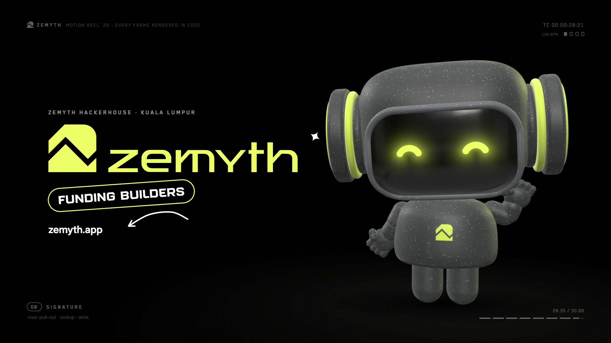
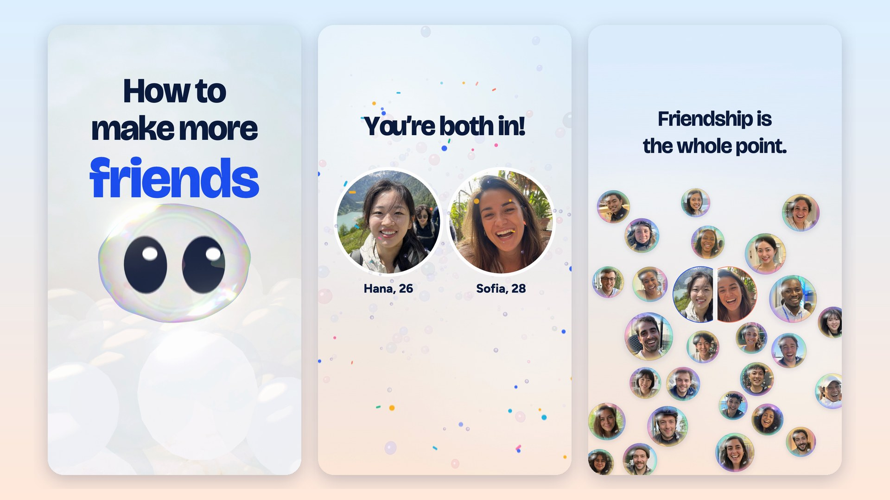

# Motion reels — rendered entirely from code

Motion-design films where every frame is rendered by code (three.js, Canvas 2D, hand-written GLSL) and
every sound effect is synthesised by code (Web Audio), captured frame-exactly with headless Chrome. Reels 01–03
synthesise their scores too; reel 04 pairs a score composed with ElevenLabs Music to the same measured beat grid. Reel 05 adds one generative step: its code render is rendered again as grey clay and re-rendered photoreal by Seedance 2.5 against the client's product photographs, and every title and the logo go back on from the code render. Reel 06 is vertical (9:16): a product film with a soap-film shader, a 3D character and an AI-generated cast of 32 fictional people, scored with ElevenLabs Music cut to the bar grid. Designed and built by Claude (Anthropic's model) in [Claude Code](https://claude.com/claude-code) sessions.

https://github.com/user-attachments/assets/b7a81968-4e57-4007-8f57-6759430e55c2

| Reel | Length | What it shows | |
|---|---|---|---|
| [01 · Claude motion reel](projects/claude-reel/) | 15 s | Type, a torus knot, 80k GPU particles, a liquid shader, a graph editor — one idea per bar | [](projects/claude-reel/) |
| [02 · Adswinning](projects/adswinning/) | 30 s | Product film: 4,032 instanced ad frames, a refracting loupe, rebuilt product UI, an anamorphic 3D logo lock | [](projects/adswinning/) |
| [03 · Zemyth](projects/zemyth/) | 30 s | Brand film hosted by a procedural 3D mascot: video-in-type, a card-flip video wall, 357 coins that become the logo, a VO-synced headline system | [](projects/zemyth/) |
| [04 · Nova Pitch](projects/novapitch/) | 60 s | Product film drawn by one line: 4,800 ignored decks, a ray-traced glass orb, the real product UI at film scale, a produced score measured to the frame, a galaxy that signs the N; every title held for its reading time | [](projects/novapitch/) |
| [05 · 翡月荟](projects/feiyuehui/) | 40 s | Brand film for a jadeite house, released photoreal: a three.js film (the ring rising over a sea of cloud like the moon, a vortex of 100 cabochons, 设计 · 雕刻 描金 · 镶嵌, the collection orbiting the sunrise, a gold phoenix lockup), rendered again as clay and re-rendered by Seedance 2.5 from the client's own product photos; every title is the code render's own pixels | [](projects/feiyuehui/) |
| [06 · almost friends](projects/almostfriends/) | 66 s, 9:16 | Product film for a friend-making app: a bubble character knocks on the wall of your bubble ("How to make more friends") until it pops on the drop; the app shown in a real phone; a 3D flight through a universe of people; an anonymous chat; a two-key unlock in silence; a circle of friends with room to breathe | [](projects/almostfriends/) |

Each reel has a `README.md` (what you're watching, how to run it) and a `LEARNING.md` (workflow,
decisions, every bug with root cause and prevention, measured quality gates). The rules all of them share — the
owner's preferences, the craft and the process, each traced to the reel that taught it — are in
[`PLAYBOOK.md`](PLAYBOOK.md).

## Run

Node 22+, Google Chrome and ffmpeg (Python 3 with Pillow + numpy for the gates). Everything runs from the repo root:

```bash
npm install
npm run preview                  # http://localhost:5173/projects/<reel>/ — click to play
npm run stills && npm run render # reel 01
npm run aw:stills && npm run aw:render && npm run aw:check   # reel 02
npm run zm:assets && npm run zm:render && npm run zm:check   # reel 03 (needs a local Zemyth site checkout, see its README)
npm run np:assets && npm run np:render && npm run np:check && npm run np:read   # reel 04 (needs a local product checkout, see its README)
npm run fy:render && npm run fy:check   # reel 05, the code render (needs the client's asset package locally, see its README)
npm run fy:real                         # reel 05, the photoreal release cut (needs the local Seedance takes)
npm run af:audio && npm run af:render && npm run af:check && npm run af:read   # reel 06 (af:render4k for the 4K master)
```

Renders are deterministic: seeded randomness, and each frame is a pure function of time.

## License

Code: [MIT](LICENSE). Open-source fonts come from npm (SIL OFL); three.js and Lucide are MIT/ISC.
Reel 03's footage, photos and two display fonts belong to Zemyth or their foundries and are **not**
included — the prep script copies them from a licensed local checkout. Reel 05's product photographs and logo belong
to 翡月荟 and are used with the client's consent; they, and everything built from them (the 3D asset package, the logo
traces, the Seedance takes), stay local. The repo holds the film's code; the release holds the finished film.
Reel 06's people are AI-generated and fictional (GPT Image 2 on Higgsfield); its score was composed with ElevenLabs
Music; the third-party app screenshots used as UI research references are not included.

*Not an official Anthropic project.*
