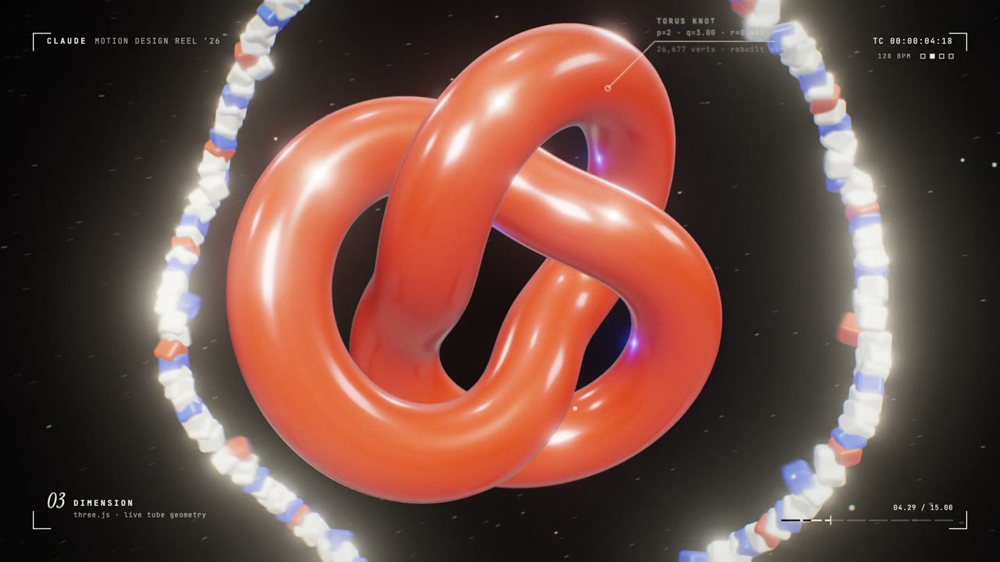
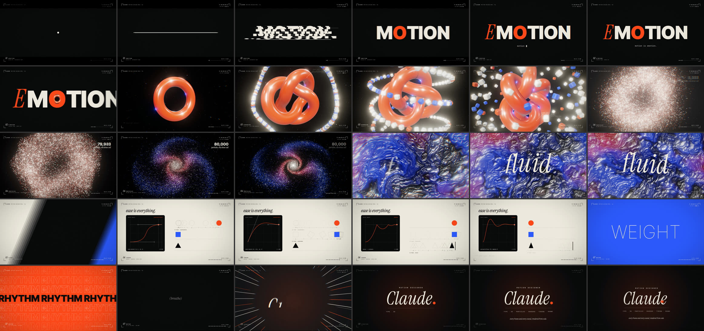

# Motion Reel — rendered entirely from code

A 15-second, 1080p60 motion-design showreel where **every frame and every sound is generated by code**:
three.js, Canvas 2D, hand-written GLSL, and a Web Audio soundtrack. There's no footage, no keyframing software, and no audio files.

It was designed and built by Claude (Anthropic's model) in a single [Claude Code](https://claude.com/claude-code) session.

<!-- VIDEO: GitHub renders a user-attachments video URL on its own line as an inline player. -->
VIDEO_URL_PLACEHOLDER

[](../../releases/latest)

▶ **Full quality (59 MB, 1080p60):** [Releases → latest](../../releases/latest)

---

## What you're watching

8 bars at 128 BPM = exactly 15.000 s. There's one idea per bar, and every cut lands on a downbeat.

| Time | Chapter |
|---|---|
| 0–3.7 s | A dot squashes and stretches into a line, the line splits into rails, and word slices assemble **MOTION**. An **E** drops in to make **EMOTION**, then the camera dives *through the O*. |
| 3.7–7.5 s | The O becomes a glossy 3D torus that splits into a live torus knot. It shatters into **80,000 GPU particles** that form a spiral galaxy, then collapse to a single point. |
| 7.5–11.2 s | A domain-warped liquid shader bursts out of that point. A 4-colour wipe leads into a live **graph editor** with onion skins and animator spacing charts. |
| 11.2–15 s | Word cards cut to the beat (including a variable-font weight sweep), a held breath, then the end card collapses back into the opening dot. |



## Stack

| Layer | Tech |
|---|---|
| 3D | three.js (physical materials, instancing, UnrealBloom) |
| Shaders | Hand-written GLSL: particles, liquid, composite, film grain |
| 2D / type | Canvas 2D: Inter Tight (variable), Instrument Serif, JetBrains Mono |
| Audio | Web Audio `OfflineAudioContext`: the whole track is synthesised and locked to the same score as the visuals |
| Capture | Playwright + headless Chrome (GPU) at 8-sample motion blur per frame |
| Encode | ffmpeg (H.264 bt709 + AAC) |

## Run it

Needs Node 22+, Google Chrome and ffmpeg.

```bash
npm install
npm run preview   # live in the browser → http://localhost:5173 (click to play)
npm run stills    # 7 checkpoint frames → out/stills/ (~10 s)
npm run render    # full render → out/claude-motion-reel-2026.mp4 (~2 min on an M2 Pro)
```

Every render is deterministic: seeded randomness, and each frame is a pure function of time.

## How it's built

[`LEARNING.md`](LEARNING.md) is the full playbook. It covers the workflow, architecture, design decisions and their rationale, quality measurements, every bug hit (with root cause and prevention), and a pre-flight checklist.

The core idea is that [`src/score.js`](src/score.js) holds every event in beats. Visuals and audio both read it, so a cut, a bounce or a keystroke lands on the exact frame where it's heard.

## License

Code: [MIT](LICENSE). Fonts are installed from npm under the SIL Open Font License, and three.js is MIT.

*Not an official Anthropic project.*
