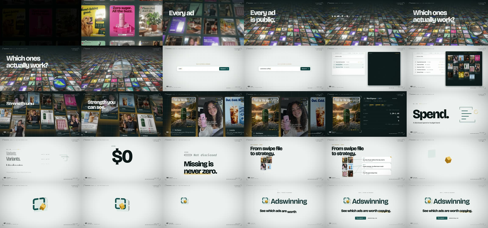

# Adswinning — a 30-second showreel rendered in code

A 30-second, 1080p60 motion-design film for [Adswinning](https://adswinning.com), the agentic ads-research
workspace. Every frame is rendered by code (three.js, Canvas 2D, hand-written GLSL) and every sound is
synthesised by code (Web Audio). The only generated media are the ad creatives on screen.


**Output:** `out/adswinning-showreel-2026.mp4` (master, 51 MB) · `out/adswinning-showreel-2026-web.mp4` (14 MB)

## What you're watching

16 bars at 128 BPM = exactly 30.000 s. There is one chapter every two bars, and each hand-off lands on the beat.

| Time | Chapter | What happens |
|---|---|---|
| 0–3.75 s | 01 Light table | One ad frame flickers on in the dark, then 4,032 more light up in a wave. The camera rises from top-down to a grazing angle with a focus pull. *Every ad is public.* |
| 3.75–7.5 s | 02 Loupe | A glass loupe hops frame to frame on the beat. SPEND, REACH, DAYS, VARIANTS and RANKED are all *not shown*. *Which ones actually work?* The lens then opens into the product. |
| 7.5–11.25 s | 03 Agent | The landing composer. `cold brew coffee` is typed on the 32nds and Research is pressed. The agent's receipts land, and 88 results fly into the well. |
| 11.25–15 s | 04 Signal | The relevance check drops 72. The 16 that remain rank into the grid, which hands off pixel-for-pixel to a 3D light table. Evidence arrives, and sulphur light pools under the strongest frames. *Strength you can see.* |
| 15–18.75 s | 05 Evidence | The #1 frame's readout counts up. SPEND says *Not disclosed*. Five signal cards follow, cut to the beat, with the variable-font specimen on VARIANTS. |
| 18.75–22.5 s | 06 Honesty | `$0` is rejected and its zero morphs into the hollow tick. *Missing is never zero.* Then the Deep Research board: *From swipe file to strategy.* |
| 22.5–26.25 s | 07 Aperture | The Proof Aperture mark is built in 3D from `mark.svg`'s own geometry. It orbits, then locks into the flat logo on the exact front view. |
| 26.25–30 s | 08 Signature | Wordmark, *See which ads are worth copying.*, then the CTA. Everything collapses back into the evidence cuboid. |



## Run it

From the repo root (Node 22+, Google Chrome, ffmpeg, Python 3 with Pillow + numpy):

```bash
npm install
npm run preview                     # live in the browser → http://localhost:5173/projects/adswinning/ (click to play)
npm run aw:stills                   # 10 checkpoint frames → projects/adswinning/out/stills/
npm run aw:render                   # full 8-sample render on 3 Chrome workers → projects/adswinning/out/*.mp4 (~3.5 min, M2 Pro)
npm run aw:check                    # frame gate (dark/blown/photosensitivity) + audio gate (per-bar RMS, LUFS)
```

`render.mjs` flags: `--samples=N` · `--from=F --to=F` · `--stills=a,b,c` · `--workers=N` · `--audio` · `--gpu` · `--out=path.mp4`.

## Stack

| Layer | Tech |
|---|---|
| 3D | three.js: 4,032 instanced frames with per-fragment depth of field, a card grid with shader-revealed evidence, and an orthographic flat-shaded logo build |
| Shaders | Loupe refraction and dispersion, SDF frames, backlight halos, composite, grain and dither |
| 2D / UI | Canvas 2D rebuilds of the product's own components (AdCard, SignalBar, ToolReceipt, composer), drawn with its Lucide icons |
| Type | Bricolage Grotesque (variable opsz/wght/wdth), Instrument Sans, IBM Plex Mono: the product's type system |
| Audio | Web Audio `OfflineAudioContext`, with every hit read from `src/score.js` |
| Capture | Playwright + headless Chrome (GPU), 8-sample motion blur with a sub-pixel jitter per sample |
| Encode | FFV1 slices → H.264 bt709 + AAC |

## Credits and honesty

- **Ad creatives** are AI-generated stills (GPT Image 2.5 via Higgsfield) for **fictional brands**: Northpour, Brewbird, Loopday, Kiln & Co. and 36 others. The film shows spend, reach and longevity figures, and none of them may describe a real advertiser, so none do. Raw generations live in `assets/raw/` (git-ignored); `tools/prep_ads.py` sizes them into `assets/ads/`.
- **Brand system** (tokens, type, mark geometry, motion spec, copy) comes from the Adswinning codebase's `DESIGN.md`, `index.css` and `mark.svg`.
- Designed, built, scored and rendered by Claude (Anthropic) in one Claude Code session. [`LEARNING.md`](LEARNING.md) is the playbook.
