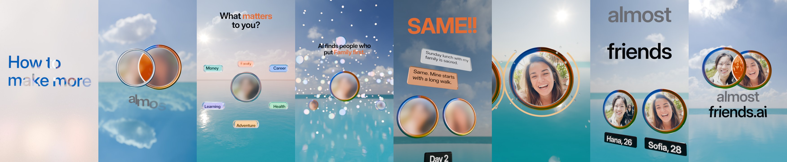

# almost friends — the Apple way



Reel 06 rebuilt from scratch: the same friend-making app (almostfriends.ai) and the same idea, *know them before you
see them*, made the way Apple presents a product. Each beat carries one idea, the product's real steps come in order,
and every act turns into the next instead of cutting to it. 53.6 s, 1080 × 1920, 60 fps. Every frame is path-traced
in Blender Cycles from Python, with no generated video. Frost is the unknown; warmth clears it.

| Time | Act | What happens | Words on screen |
|---|---|---|---|
| 0–2.0 s | A · Hook | The words clear in a fogged pane, one line per beat, over a sunny city; on the drop the camera dives through "friends" | How to / make more / friends |
| 2.0–6.0 | A · Name | A river of glass strangers; two of them meet in a ring of light and their overlap turns gold: the mark; the name flies in letter by letter | almost / friends.ai |
| 6.0–14.1 | B · What matters | A giant 1; the sea lights up; six tags burst out of you onto a dial; the dial turns each pick to its place and it glides into your ring, filling a third with its colour while the horizon takes it on; the rest drift away; you launch | 1 · What matters to you? · Family · Adventure · Career |
| 14.1–22.2 | C · The search | A giant 2; sixty glass people fill the sky; search pulses; on the brass hit, the match; the warp along the thread; you land side by side | 2 · AI finds people who put Family first. · You both put Family first. |
| 22.2–30.2 | D · Three days | A giant 3; three time-lapse days, each from a new angle; one message a day; SAME!! on day 2 | 3 · No names. No photos. Just talk. · Day 1 · 2 · 3 |
| 30.2–34.3 | E · Two yeses | A giant 4; rings draw round you both; yours clicks open; the breath: near silence, the camera creeps onto her closed ring | 4 · It takes two yeses. |
| 34.3–42.3 | F · The reveal | Her ring clicks, the sun breaks out behind her, the frost bursts into crystals: the first face in the film; then yours. The camera circles in on both; "almost" crumbles away from "friends"; a hard pull back finds three more pairs opening | You're both in! · Hana, 26 · Sofia, 28 · almost friends → friends |
| 42.3–53.6 | G · The end | Up into a sky of friends; the end line; the two of you slide into the mark; the name builds; one flip on the last hit; silence | Know them before you see them. · almost / friends.ai |

- [`WOWMAP.md`](WOWMAP.md): the energy curve, with 42 moments and a new picture at least every 2 s, plus the owner's notes on it.
- [`LEARNING.md`](LEARNING.md): the decisions, every bug with its cause and what now prevents it, and the numbers.
- [`research/`](research/): Apple's motion and film principles, the owner's references filtered for fit, and how top
  studios go all out on motion design. The reference frames themselves are third-party and are not included.

## Run (from the repo root)

Blender 5.2+, ffmpeg, Python 3 with numpy, scipy, soundfile, mido and Pillow, Node 22+ with Google Chrome for the type.

```bash
python3 projects/almostfriends-apple/film/tools/fetch_hdris.py   # the eleven CC0 skies (Poly Haven, 4k)
python3 projects/almostfriends-apple/film/tools/people_blur.py   # the frosted portraits, from ../almostfriends/assets/people
node    projects/almostfriends-apple/film/tools/type_hook.mjs    # the hook's mask (committed; rerun after changing it)
node    projects/almostfriends-apple/film/tools/type_film.mjs    # names, days, messages, tags (committed)
node    projects/almostfriends-apple/film/tools/type_kinetic.mjs # every kinetic line, one PNG per glyph (committed)
python3 projects/almostfriends-apple/film/tools/music_film.py    # the music edit + film/timing.json, from the Suno stems
python3 projects/almostfriends-apple/film/tools/sfx_film.py      # 123 effects on the cue sheet, the mix at -14 LUFS
blender -b -P projects/almostfriends-apple/film/build_film.py -- --acts A,B,C,D,E,F,G   # film.blend + the camera gate
blender -b projects/almostfriends-apple/film/film.blend -P projects/almostfriends-apple/film/render.py -- \
    --frames 0-3215 --pct 100 --samples 32 --depth 8 --out projects/almostfriends-apple/film/out/master --skip-existing
python3 projects/almostfriends-apple/film/tools/encode.py master   # out/almostfriends-2026.mp4 + the web cut
python3 projects/almostfriends-apple/film/tools/check_jumps.py projects/almostfriends-apple/film/out/almostfriends-2026.mp4 \
    --allow=2.02,4.03,26.15,26.82,28.17,34.27
python3 projects/almostfriends-apple/film/tools/energy.py projects/almostfriends-apple/film/out/almostfriends-2026.mp4
```

A preview is the same render at `--pct 50 --samples 16 --threshold 0.05` on every other frame
(`--frames 0-3215:2`), encoded with `encode.py preview out/prev50`.

## Layout

| path | what |
|---|---|
| `film/afx.py` | the toolkit: beats and bars, springs and eases; glass, frosted people with their priority rings (and the fill that colours yours as you choose), the overlap lens; the HDRI sky blend with its horizon wash; the sea; kinetic type; 3D numerals; shard bursts; bodiless light |
| `film/act_a.py` … `act_g.py` | one module per act: each keys its own frames, proposes the camera (`cam(f, ctx, prev)`), and may ask for cuts (`ctx['cuts']`) and titles placed on the frame (`ctx['titles']`) |
| `film/build_film.py` | builds the acts, smooths the whole camera path as one (wider where acts meet), polishes every animated channel, places the titles on the final camera, prints the jolt gate, saves `film.blend` |
| `film/render.py` | renders a list or range of frames (GPU), skipping what exists |
| `film/timing.json` | the film's beats and bars in seconds and frames, measured from the song's MIDI tempo map |
| `film/type/` | every word as a texture, set by Chrome in Inter Display: static lines (`type.json`), kinetic glyphs (`kinetic.json`), the hook's mask (`hook/`) |
| `film/tools/` | the type, music, effects, frost and sky tools; `encode.py`; the gates `check_jumps.py` and `energy.py` |
| `assets/fonts/` | Inter Display (SIL OFL) |
| `assets/hdri/hdri_info.json` | each sky's name and measured sun; the skies themselves are fetched |
| `assets/people_blur/` | the cast's portraits behind frost (rebuilt by `people_blur.py`) |
| `audio/suno/sunny-groove/` | the score's stems and their MIDI (Suno, "Sunny Groove") |

## Credits

The cast is reel 06's: AI-generated, fictional people (GPT Image 2 on Higgsfield). The skies are CC0 HDRIs from
[Poly Haven](https://polyhaven.com/license). The score is "Sunny Groove", made in Suno by the owner and cut to the
picture from its stems and MIDI. Every effect is synthesised in `sfx_film.py`. The type is Inter Display (SIL OFL).
