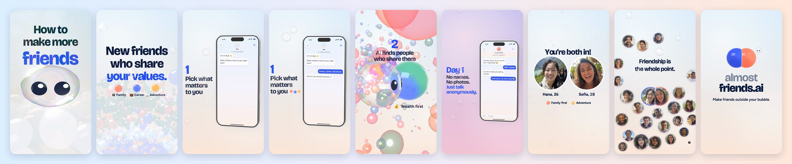
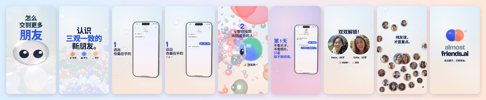

# almost friends — special edition



The released 66 s film (reel 06: [`../almostfriends`](../almostfriends/), tag `almostfriends-v1.0`), re-rendered with
a liquid engine. The cut is the release's, frame for frame: the same shots, the same words, the same score and mix. What
changed is what the bubbles are made of. Every bubble that carries the story is now raymarched soap film or ink
(`src/gl/liquid.js`), so bubbles that touch share a real wall, films tear open, droplets merge and the light is real:
- your orb, which fills with your inks and tears as the camera dives through it;
- Bub, the people he checks and the one, with a gold glass ring that locks on;
- the match's double bubble, SAME!! and the unlock;
- the reveal, every friend's film, and the mark.

The phone is a real 3D device under a camera that never rests, and every line of type stands inside its shot (beside,
behind or under its subject, in the same lens and light, moved by the scene) instead of on top of it.

- [`STORYBOARD.md`](STORYBOARD.md) — the brief, why this shape, and every liquid moment with its time.
- [`LEARNING.md`](LEARNING.md) — the decisions, what went wrong and what now prevents it, the numbers.
- [`v5/`](v5/) — the first special edition (44 s, a new film), kept as it was; the owner preferred the released cut's
  tempo and taste, so v6 took v5's material and none of its structure.

## Run (from the repo root)

```bash
npm run afs:stills     # review stills across the liquid moments → projects/almostfriends-special/out/stills/
npm run afs:render     # 1080p master, 16 samples, the released film's mix → out/almostfriends-special-2026.mp4
npm run afs:render4k   # the 2160×3840 master
npm run afs:check      # frame gate, jump gate (the release's designed hits), the liquid colour check
npm run afs:read       # reading time of every string on screen (advisory)
npm run afs:render:zh  # the Chinese cut (and afs:render4k:zh, afs:check:zh, afs:read:zh)
```

## The Chinese cut (中文版)



The same film in Chinese, as the released film has one: the same picture and timing, the words from the released
Chinese cut (`src/copy.js`, `?lang=zh`, set in Noto Sans SC) and its own mix (`../almostfriends/audio/mix-zh.wav`, whose
clicks land on the Chinese phrases). The special edition's type follows the released cut's rules for Chinese: a step
caption keeps the writer's line breaks and breaks only at its own phrase marks (never inside 你最在乎的), is led at 1.14
and aligned on its ink; your picks' beads drop to a row under a long Chinese line instead of hiding behind the phone;
朋友 is written on the wall, survives the pop and flips into "friends"; the brand stays in Latin.

Live preview: serve the repo root and open `projects/almostfriends-special/index.html` (click to play, space to
pause, arrows step a beat; `?t=50` starts there, `?wav=/projects/almostfriends/audio/mix.wav` plays the soundtrack).

## Layout

The code is the released film's (`src/scenes/hook · howto · unlock · foam`, the phone in `src/ui/`, the world in
`src/gl/` and `src/world/`); the special edition adds:

| path | what |
|---|---|
| `src/gl/liquid.js` | the liquid: a raymarched signed-distance scene of up to 48 primitives (spheres, rounded boxes, tori, walls, tearing films), smooth-unioned in groups; soap film, ink under a glossy skin, Liquid Glass; each primitive with its own clip rect |
| `src/liquid2d.js` | liquid placed by the 2D layout (one fixed lens), Bub as a liquid primitive with his face, the ink orb, the wall two bubbles share |
| `src/engine.js` | the released frame pipeline plus the liquid pass between UNDER and OVER (frames without liquid render exactly as released) |
| `src/gl/phone3d.js` | the phone in 3D: titanium band, black glass, the released screens drawn live onto its glass |
| `src/ui/phonecam.js` | the lens on the phone: a framing plus an angle per key; two-shots (`beside`) that turn the phone to its caption |
| `src/gl/sign.js` | type as a thing in the shot: a plane pinned where its key shot sees it, depth-tested, focus-blurred, lit from behind |
| `src/scenes/steps.js` | the four steps' captions as signs: their compositions, the rack focus, the days' counter and sun |
| `src/scenes/air.js` | soap bubbles drifting through the phone's sky, a few rising through each caption |
| `tools/check_liquid.mjs` | every brand colour reaches the liquid in linear light, decoded once |
