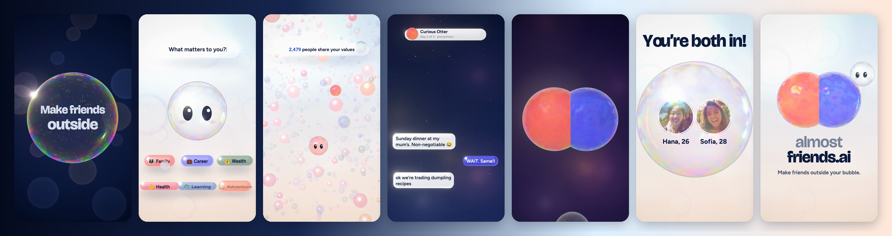

# almost friends — special edition



A 44 s vertical (1080×1920, 60 fps) showreel cut of reel 06, rendered in code: one continuous take where Bub — the
app's AI, a soap bubble with eyes — is the interface, and every bubble, droplet and piece of glass UI is one
raymarched liquid. The released film lives next door in `projects/almostfriends` (tag `almostfriends-v1.0`) and is
untouched; this cut shares its cast photos and fonts and nothing else.

- `STORYBOARD.md` — the references, the idea, the beat sheet, the look, the camera, the sound.
- `LEARNING.md` — the decisions, what went wrong and what now prevents it.

## Run

```bash
node projects/almostfriends-special/render.mjs --stills=0s,2.1s,8s,14.3s,27.5s,38.5s --samples=6   # stills → out/stills/
node projects/almostfriends-special/tools/cues.mjs > projects/almostfriends-special/audio/cues.json  # the cue sheet
python3 projects/almostfriends-special/tools/mix.py --score-db -4.5                                  # → audio/mix.wav
node projects/almostfriends-special/render.mjs --samples=10 --workers=3 --wav=projects/almostfriends-special/audio/mix.wav
node projects/almostfriends-special/render.mjs --scale=2 …                                           # the 2160×3840 master
npm run afs:check                                                                                   # frame + jump gates
npm run afs:read                                                                                    # reading time (advisory)
```

Live preview: serve the repo root and open `projects/almostfriends-special/index.html` (click to play, space to
pause, arrows step a beat; `?t=12.5` starts there, `?wav=…` plays a soundtrack along).

## Layout

| path | what |
|---|---|
| `src/engine.js` | the frame: UNDER 2D → 3D raster (the crowd) → the liquid layer → bloom → OVER 2D → lens → linear accumulation over the shutter → sRGB, grain, dither |
| `src/gl/liquid.js` | the liquid: a raymarched signed-distance scene of up to 48 primitives (spheres, rounded boxes, tori, walls, tearing films), smooth-unioned in groups; soap film and Liquid Glass, blended across a merge; Bub's face painted on his film |
| `src/gl/crowd.js` | the crowd: instanced glass orbs with a scan front (from the released film) |
| `src/film.js` | the director: the live acts, the camera, Bub across the film, shadows, sub-frames per frame |
| `src/acts/` | `hook` (night, the pop, day), `values`, `crowd`, `chat` (three days, the breath), `friends` (reveal, foam, mark) |
| `src/timeline.js` | every time picture and sound share |
| `src/cues.js` | the cue sheet, built from the timeline |
| `src/camera.js` | keyed camera, the hand, shakes |
| `tools/music.py` · `score_check.py` | the score's composition plan · takes measured against the grid |
| `tools/sfx.py` · `sfx_meta.py` · `mix.py` | the effects library · its measurements · the mix and master |
| `tools/bench.mjs` · `sheet.py` | GPU-synced ms per sub-frame · contact sheets of stills |
