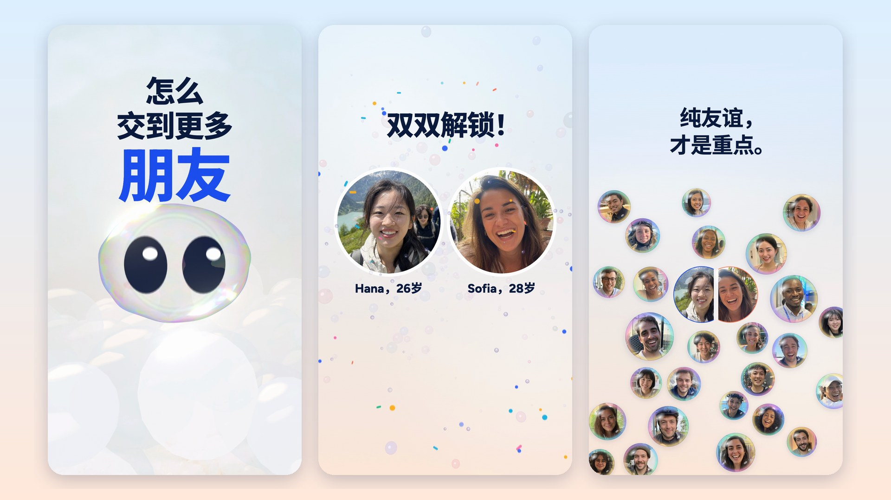

# almost friends — storyboard v6 (reel 06), locked and released, with a Chinese cut

**The app.** You tell an AI what matters most in your life (family, wealth, career…). It finds people who put the
same things first. You chat anonymously for 3 days — no names, no photos. Only if you **both** tap Unlock do you see
each other. Not dating: friends, outside your circle. Domain: **almostfriends.ai** (on the end card).

**The film.** 66 s · vertical 1080×1920 · 60 fps · 120 BPM (1 beat = 30 frames, 1 bar = 2 s, 33 bars). No voice:
the words are chat bubbles, captions and big type; the score and the foley carry the feeling (sound on), the picture
and the words carry the meaning (sound off). Anchors live in `src/score.js`; this file follows them.

**What v2 changed (owner's notes on v1).** The opening was weak and the front half explained the app with bubbles
instead of showing it; frames cut; lines went by too fast; a scrolling viewer has zero context. v2 opens on a
question anyone can answer, says the name and the value by 5.4 s, then shows steps 1–3 inside one phone with a plain
caption above it the whole time. The back half (the unlock, the faces, the foam, the mark) is v1's, 6 s later.

## The idea: outside your bubble

"Your bubble" is the everyday word for your social circle, and the app exists to get you out of it. Chat bubbles are
its interface. So the film is made of **one object at two scales**: the flat chat bubble and a real soap bubble.

| Bubble moment | What it means |
|---|---|
| Bub knocks on the wall of your bubble — **How to make more friends** — until **it pops** | the promise, and the way out of your bubble |
| "friends" survives the pop and becomes the name; the droplets become the mark (a double bubble) | the answer is this app |
| The app icon; Bub dives in and opens it | here it is |
| Your three picks colour your orb; a crowd of bubbles; the scan lights the ones with your colours | like-minded people |
| Two bubbles **kiss into a double bubble**: one shared wall between them | the match |
| **SAME!!** bursts out of the chat | a stranger who gets you |
| Both unlock → **the wall pops** → two real faces | you choose each other |
| Bubbles join into **foam** — groups, not couples | your circle grows |
| The mark: two circles sharing a wall | two people, one conversation |

**Name: almost friends** (confirmed by the owner). It *is* the mechanic: for three days you're almost friends; when you
both unlock, "almost" pops and you're friends.

**Copy arc.** "How to make more friends" (the promise, v5: the owner's words) → "almost friends" (the answer) → steps
1–4 (the how) → "SAME!!" (a stranger who gets you) → "Same values. New friends." (the payoff).

## Rules (owner's notes on reels 02–06 and the research)

- **No zero-context viewer left behind:** a question first, then the name with what it's for, then numbered steps in
  plain words; app words (matches, unlock) arrive with the screen that shows them. "friends, not dates" by 6.4 s.
- **Something every ~2 s:** 32 shots in 66 s; the longest gap is the 4 s wait for their yes (kept on purpose).
- **v6 hook, one bar (owner: "directly know what we are doing"; "maximum 2 seconds"; staging from research-hooks.md
  C1):** frame 0 is one subject on a quiet field — Bub's face pressed on the screen, eyes on you — and the first words
  are the promise, one line per knock: "How to" (frame 0) / "make more" (0.25 s) / "friends" (0.5 s); a glance, one
  push, a black spot, a tremble, and the pop on the drop at 2.0 s; "friends" carries straight into the name (by 2.4 s).
  Never a logo card first.
- **One phone, one caption:** steps 1–3 happen in the app, a caption above it; a caption is gone before the next one
  arrives; the step badge stays and its digit rolls (1 → 2 → 3).
- **Social safe band:** caption text inside y 288–520; everything tapped or read in the app inside y 620–1248. The
  phone rises with the conversation (`LIFT` in `src/scenes/howto.js`) and fades into the sky above y 610.
- **Reading time:** 0.5 s + 0.375 s a word as a guide (`tools/check_reading.mjs`); flexible for labels.
- **No cuts:** screens change with iOS pushes; the app opens out of its icon; the phone pulls back and comes forward.
  `tools/check_jumps.py` passes with only its designed hits: the knocks, and the sky turning to the next dawn on each
  day's tick.
- **Not dating, by construction:** no hearts, no couples framing, no "It's a match"; groups and foam. (v4, owner: no
  need to say "not dates" either.)
- **People** are ordinary, casual iPhone snapshots (owner's rule) — never models.

## Beat sheet (v6)

v6 answers the owner's 3 notes on v5: the hook is one bar (2 s, the music's second intro bar cut, so everything after
it is 2 s earlier than v5), and the cast is recast to the owner's brief (young, middle- to high-income, international)
with two new leads, Hana and Sofia. v5 answered 2 notes on v4: the hook copy ("How to make more friends") and a circle
of friends with air between them instead of a packed foam. **v6 is locked and released.**

| Time (s) | Shot | Picture & motion | Words on screen |
|---|---|---|---|
| 0.0–0.65 | 01 Knock knock knock | Frame 0: the screen is the wall of your bubble; Bub has just smacked into it from outside, flattened, eyes on you; two more knocks, a ripple and a line each; a pale sea of people behind | **How to** · **make more** · **friends** (big, blue) |
| 0.65–1.0 | 02 Hope | Its eyes flick up to "friends", then back at you, blushing | (held) |
| 1.0–1.6 | 03 Push | It pushes: the wall bulges and thins, colours slide; a black spot blooms (1.25), its eyes go huge | (held) |
| 1.6–2.0 | 04 Tremble | The film trembles; Bub shuts its eyes | (held) |
| 2.0 | 05 Pop | The wall tears on the drop; "How to make more" flies apart; Bub bursts through past the lens; colour floods the people | **friends** stays |
| 2.05–3.15 | 06 Name | "friends" glides down into the name as the droplets inflate into the 3D mark (two soap bubbles kissing); "almost" pops in above it | **almost / friends.ai** |
| 3.15–3.4 | 07 Dive | The mark swings blue-first; the camera dives through its shared wall (a bright film shimmer) | — |
| 3.4–6.75 | 08 Value | The value alone over the world of people gliding by; three tags pop in | **New friends who share your values.** · *Family · Career · Adventure* |
| 6.75–7.5 | 09 Tap | The app icon pops in; Bub dives into it (the tap); the app opens | — |
| 7.5–8.75 | 10 Phone | A real iPhone, whole | — |
| 8.0–9.75 | 11 Tags | Push in; Bub asks; six tags (Learning replaces Faith) | **1 · Pick what matters to you** |
| 9.75–10.6 | 12 Taps | Three quick taps on 8ths | *Pick 3 · 3/3* |
| 10.6–13.25 | 13 Sent | Your picks sent; Bub answers | *Family, Career, Adventure* · *Got it! Let me look around 🔎* |
| 13.25–14.85 | 14 Radar | iOS push to matching; the badge rolls to 2; the dive into your orb | **2 · AI finds people who share them** |
| 14.85–16.15 | 15 Universe | Your orb bursts; Bub (3D) swoops past the lens into the crowd, shouldering bubbles aside, looks around | — |
| 16.15–17.6 | 16 Not this one | It bumps someone, peers, shakes its head | *💰 Wealth first* |
| 17.6–18.65 | 17 Nor this one | Someone else; a quicker shake, a sigh at you | *💪 Health first* |
| 18.65–19.25 | 18 Scan | A breath, then a scan: Family-first people glow | — |
| 19.25–22.75 | 19 Yes! | A glint; Bub dashes over, bumps the one on the downbeat (20.0), hops; the rush into their bubble | *👨‍👩‍👧 Family first* |
| 22.75–27.5 | 20 Match | Out of their orb in the app; your bubbles kiss; Say hi | **Family first? So are they.** |
| 27.5–32.0 | 21 Push-in | The chat; the push-in to 2.2× on your reply | **3 · Chat anonymously for 3 days** · *WAIT. Same!!* |
| 32.0–33.5 | 22 SAME!! | SAME!! bursts out as the camera pulls back | **SAME!!** |
| 33.5–41.5 | 23 Three days | Three suns behind the phone; the last message | **No names. No photos. Just talk anonymously.** · **Day 1 · 2 · 3** |
| 41.5–44.75 | 24 Ready? | In the phone: the sheet rises; you tap | **4 · It takes two yeses.** |
| 44.75–49.2 | 25 Breath | The slow push onto their slot; silence (kept from v1) | *Waiting for Curious Otter…* |
| 49.2–50.0 | 26 Unlock | Their padlock rises big, springs open, turns gold; their slot floods gold; click-clack in the silence | *You're both in!* (the button) |
| 50.0–50.85 | 27 Pop | The drop: the phone thrown back, both orbs burst out and kiss, the wall pops | **You're both in!** |
| 50.85–54.0 | 28 Faces | Two real faces pop with confetti; names; what they share | *Hana, 26* · *Sofia, 28* · *Family first · Adventure* |
| 54.0–56.0 | 29 friends | "almost" swells and pops | **almost / friends → friends** |
| 56.0–59.0 | 30 Circle | You two kiss into a double bubble; friends pop in round you, each its own soap bubble, faster and faster; the camera eases back | **Same values. New friends.** |
| 59.0–62.0 | 31 26 friends | The circle fills the frame with air between every two (the edge ones run off-frame); everyone rushes into the mark | **Friendship is the whole point.** |
| 62.0–66.0 | 32 Mark | The mark, the name, the line; Bub winks | **almost / friends.ai** · *Make friends outside your bubble.* |

**Continuity chain.** Bub knocking on the wall of your bubble → the wall tears (2.0 s) → "friends" falls into the name, the
droplets into the 3D mark → through its wall → the
value → the app icon → Bub's dive (the tap) → the launch → the phone → chips → your orb → the universe → Bub's search →
the one → the double bubble → the chat → SAME!! → three suns → the sheet → their padlock → the wall pops → two faces →
"almost" pops → a circle of 26 friends → the two of you become the mark.

## Cast (Higgsfield GPT Image 2, casual iPhone snapshots, ordinary-looking people)

v6 recast to the owner's brief: young, middle- to high-income, international. Everyone is 24–32, photographed by a
friend in a setting that says a comfortable life (travel, sport, cafés, rooftops), still unposed and average-looking
(the owner's rule since v1).

- **Hana, 26** (you) — Korean; a family hiking trip in the Swiss Alps, her parents on the trail behind (Family · Adventure).
- **Sofia, 28** (Curious Otter) — Spanish; a long family Sunday lunch on a terrace in Valencia.
- **30 friends** from Japan, Nigeria, Italy, Korea, Spain, the UK, Sweden, Australia, France, China, Thailand,
  Germany, Brazil, Vietnam, Mexico, the Netherlands, the Philippines, Ghana, Taiwan, Lebanon, South Africa, Poland,
  Canada, the Czech Republic, Singapore, Portugal, Colombia and the US; 16 women, 14 men.
- Prompts: `assets/people/prompts-v6.tsv`; generation `tools/gen_people.py`; face crops `assets/people/crops.json`
  (`tools/face_crops.py`). Sofia's portrait was upscaled to 2k for the 4K master. Earlier casts stay local.

## The Chinese cut (中文版)

The owner, after the lock: "做个中文版的, font must be great". The Chinese cut is the same film: the same picture, the
same timing to the frame, the same score. Only the words change, and they are adapted, not translated word for word.
Simplified Chinese, spoken and young, in the viewer's own idiom. All of it lives in one table, `src/copy.js`. The
English and Chinese tables must have the same shape: a missing line throws at load, so the cut can never ship
half-translated. Build it with `?lang=zh` (`npm run af:audio:zh`, `af:render:zh`, `af:check:zh`, `af:read:zh`).

**The type.**
- **Font: Noto Sans SC (Source Han Sans SC).** The Source Han Sans design, under SIL OFL, so it can ship in the
  repo. Variable 100–900, so the film's heavy display weights (790–820) and its UI weights (500–750) are real cuts,
  never synthesised bold.
- **Latin stays in Latin faces.** Latin letters and digits keep Bricolage Grotesque and Figtree, the film's own
  faces, so "AI", "TA", "Bub" and "3" match the English cut.
- **Chinese is set by its ink.** Measured in the font, a Han character's ink rises 0.81–0.87 em; a Latin capital rises
  0.70. So:
  - **Hook:** re-spaced to 128 / 128 / 248 px, with 朋友 exactly as wide as 交到更多, between the safe zone's top
    and Bub.
  - **Captions:** they hang from the step badge by their ink, with lines led at 1.14.
  - **Centring:** every line is centred on its ink. A trailing 。 or ？ carries a blank half-em, which would push a
    centred line to the left.
- **Punctuation and line breaks.**
  - Full-width punctuation throughout.
  - Casual chat types "!!" and "??" half-width, as people do. Noto Sans SC's full-width ！ also sits at the left of a
    whole em, which would leave gaps.
  - Chat bubbles break between words (ICU segmentation), never before closing punctuation.
  - The writer can force a break, so the idiom 雷打不动 never splits.
- **The hero word.** 朋友 survives the pop like "friends" does, glides into its place in the name, and flips into
  "friends" like a split-flap (0.16 s, a click as it folds flat). The name translates itself.
- **The brand stays Latin:** almost / friends.ai, Bub, the AI tag, and the "almost → friends" punchline.

**The words.**

| Beat | English | 中文 | Why |
|---|---|---|---|
| Hook | How to / make more / friends | 怎么 / 交到更多 / 朋友 | The question as people type it |
| Value | New friends who share your values. | 认识 / 三观一致的 / 新朋友。 | 三观一致 is how young Chinese speakers say "shares my values" |
| Priorities | Family · Wealth · Career · Health · Learning · Adventure | 家庭 · 财富 · 事业 · 健康 · 学习 · 冒险 | |
| Step 1 | Pick what matters to you | 选出 / 你最在乎的 | |
| Step 2 | AI finds people who share them | AI 帮你找到 / 志同道合的人 | 志同道合: an idiom for people who share your aims |
| Step 3 | Chat anonymously for 3 days | 先匿名 / 聊 3 天 | 先 ("first") promises the unlock to come |
| | No names. No photos. Just talk anonymously. | 不看名字，不看照片。/ 只看聊不聊得来。 | 不看 · 不看 · 只看: one rhythm; 聊得来 = "we click" |
| Step 4 | It takes two yeses. | 要两个人 / 都点头。 | A nod is consent, and it is visual |
| The search | Wealth first · Health first · Family first | 财富第一 · 健康第一 · 家庭第一 | |
| The match | Family first? So are they. | 家庭第一？TA 也是。 | TA: the written, gender-neutral pronoun |
| The chat | WAIT. Same!! · SAME!! | 等等，我也是!! · 我也是!! | |
| | Sunday dinner at my mum's. Non-negotiable 😂 | 每周日都回我妈家吃饭，雷打不动 😂 | 雷打不动: "not even thunder moves it" |
| | ok we're trading dumpling recipes | 行，那必须交换饺子秘方了 | 秘方: a family's secret recipe |
| The sheet | 3 days in. Ready to meet properly? | 3 天到了。要正式认识一下吗？ | |
| | Nothing is shown unless you both unlock. | 两个人都解锁，才会看到彼此。 | |
| The reveal | You're both in! | 双双解锁！ | |
| The circle | Same values. New friends. | 三观一致。新朋友。 | |
| | Friendship is the whole point. | 纯友谊，才是重点。 | 纯友谊 ("pure friendship") says "not dating" positively |
| End card | Make friends outside your bubble. | 走出圈子，交新朋友。 | 圈子 ("circle") is the social sense of "bubble" in Chinese |

The anonymous handle is 好奇水獭 (Curious Otter); names read "Hana，26岁". The rest of the thread is in `src/copy.js`.

**The sound.** The same score and the same mix. The cue sheet follows the cut's own words: the value clicks once per
Chinese phrase (4, not 6), "双双 · 解锁！" lands with two clicks (not three), and the flip of 朋友 gets its own click
(`audio/cues-zh.json` → `foley-zh.wav` → `mix-zh.wav`).

## Decided at lock (v6)

1. The cut: v6, 66 s, locked by the owner and released as a 1080p master, a 4K master and a web encode.
2. "Learning" replaces "Faith" among the six priorities (Malaysia's Content Code §8.7; Faith's violet read as "AI
   purple").
3. The Chinese cut (中文版): the same film with adapted words and Noto Sans SC, rendered from the same code (`?lang=zh`).

## Open after the release

1. A ≤60 s cut for TikTok ads (its policy caps ads at 60 s) and a ~30 s cut for paid social.
2. An A/B hook cell: the research's runner-up, "Snow globe".
3. Before launch: TikTok's AI-generated-content label for the portraits; expect dating classification; a trademark
   search.

Release: [`almostfriends-v1.0`](https://github.com/pupubird/claude-motion-reel/releases/tag/almostfriends-v1.0).
