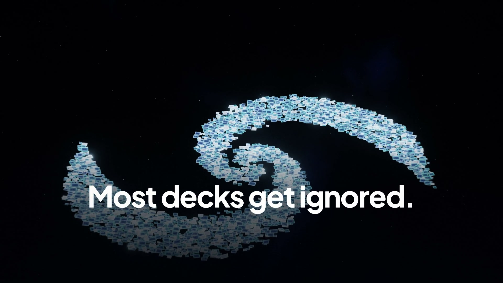
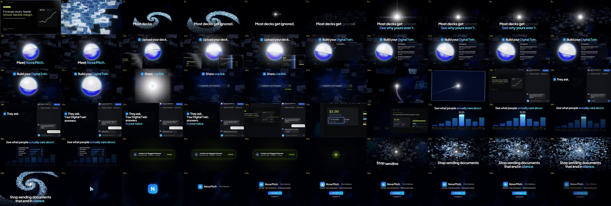

# Nova Pitch — a 60-second product film rendered in code

A 60-second, 1080p60 product film for [Nova Pitch](https://novapitch.ai), the pitch-deck product whose one link
answers back. Every frame is rendered by code: three.js, Canvas 2D and hand-written GLSL. The score was composed
for the film with ElevenLabs Music and re-cut on its bar grid. The Digital Twin's voice is ElevenLabs TTS. All foley
is synthesised by code and locked to the same beat grid as the picture.



**Output:** `out/novapitch-film-2026.mp4` (master) · `out/novapitch-film-2026-web.mp4` (web)

## The idea: one line

A deck that is sent is a line that goes out and never comes back. The whole film is drawn by that one line. In
the dark it dies. Nova Pitch brings it back to life: it carries your deck, carries their question and your answer,
returns home as signal, and finally signs the N. The film opens on a galaxy of decks going dark and ends on the
same galaxy igniting and collapsing into the mark.

## The story

30 bars at 120 BPM = 60.000 s. One beat is 30 frames, so every cut and hit lands on a frame boundary. The product
is named in the first 10 seconds, then walked through in the site's own four steps. Every title stays readable
for at least 0.5 s + 0.375 s a word, measured from the rendered frames, and no act boundary drops to black.

| Time | Act | What happens |
|---|---|---|
| 0–6 s | I · Silence | Frame one is the Luminex slide in extreme close-up. Powers of ten: the camera tears out through a lit spiral arm to a whole galaxy of decks. **Most decks get ignored.** The lights go out along the arms, closing in on ours, the last light. Typing dots appear, then stop. |
| 6–12 s | II · Ignition | On the drop, our deck erupts into a nova, a new star in the galaxy, and its wave relights the arms. **See why yours won't.** The camera dives into the light as it cools into Nova, the product's glass orb. **Meet Nova Pitch.** |
| 12–22 s | III · Upload | **1 Upload your deck.** The eight real slides stream past the lens into the orb, scanned in flight. The title bar rolls on: **2 Build your Digital Twin.** The Knowledge Base builds beside the orb, each answer riding a line out of it, and holds to be read. |
| 22–28 s | IV · Share | **3 Share one link.** Nova swells and implodes, its glow gathering into a star; the star opens into the line, and the line draws the link field. The line launches through the dead decks and powers on the recipient's screen. |
| 28–36 s | V · Engage | The recipient's room, seen first. **4 They ask. Your Digital Twin answers. In your voice.** *How fast does it pay back?* is answered in the Twin's voice, and the avatar becomes Nova while it speaks. The Slide 5 citation pops on "slide five"; a click jumps the deck to the cited figure. |
| 36–46 s | VI · Signal | **See what people actually care about.** Slide 5 flies home into the owner's attention row (5m 52s, 6 questions), then the top questions, and **Jordan Lee flagged interest.** The card folds into a point while the field fades up under it. |
| 46–52 s | VII · Payoff | **Stop sending documents that end in silence.** The point whitens into the line, which races through the dead decks; each one ignites. The groove drops out as "silence." lands; the field swirls into the galaxy and collapses to a star. |
| 52–60 s | VIII · Signature | The star becomes the pen and signs the N; the gradient tile blooms on the final hit. It is the same tile as the step badges: 1, 2, 3, 4 … N. **Nova Pitch \| Pitch Better.**, then *One link. Your whole pitch — that answers back.*, then Start free and novapitch.ai. |



## Run it

From the repo root (Node 22+, Google Chrome, ffmpeg with `pdftoppm`, Python 3 with Pillow + numpy). The client's
showroom deck and demo marks are not in this repo. `prep_assets.sh` pulls them from a local checkout of the
product (`RELATEFY` overrides the path):

```bash
npm install
npm run np:assets     # Luminex slides (2560×1440) + demo marks → projects/novapitch/assets/ (git-ignored)
npm run np:stills     # 13 checkpoint frames → projects/novapitch/out/stills/
npm run np:render     # 8-sample final on 3 Chrome workers → projects/novapitch/out/novapitch-film-2026.mp4
npm run np:check      # frame gate (+ dips and drops at transitions) + audio gate
npm run np:read       # reading-time gate, measured from the renderer: 0.5 s + 0.375 s a word
```

Live preview: `npm run preview`, then open `http://localhost:5173/projects/novapitch/` and click to play.
`render.mjs` flags: `--samples` · `--from/--to` · `--stills` · `--workers` · `--scale=2` (a 3840×2160 master) ·
`--audio` · `--stem=music|sfx|vo` · `--no-audio` · `--gpu`.

Regenerating media (key from `ELEVENLABS_API_KEY` or the repo-root `.env`, held in memory only):

- **Score:** `python3 projects/novapitch/tools/music.py --seed 303 --name t6` composes the source take.
- **Re-cut:** `tools/recut.py` fits the take to the film's bars.
- **Hits:** `tools/kicks.py` builds the hit map.
- **Voice:** run `tools/vo.py`, then `tools/vo_meta.py`, for the voice and its Scribe timings.
- **Checks:** `tools/beats.py` checks a take's tempo, grid drift and structure, and `--map` checks the re-cut against the film's bars.

## Stack

| Layer | Tech |
|---|---|
| Orb | Nova as an analytic ray-traced shader: two liquid phases, a travelling-wave interface read as the meniscus line, Fresnel, iridescent rim, a conic aura, true sphere depth, and voice, heat, gulp and implosion reactions |
| 3D | three.js: 4,800 instanced decks with trails, darkness fog, sub-pixel "speck" rendering, per-fragment DOF, a scheduled chain ignition and a spiral-galaxy morph and collapse; screen-width ribbons for the line; the pixel-exact screen the room arrives on |
| 2D / UI | Canvas 2D rebuilds of the product's own components (recipient room, citation pill, composer, Knowledge Base, Links field, analytics), drawn with its Lucide icons |
| Type | Plus Jakarta Sans (display) and Inter (UI), the product's next/font pair; JetBrains Mono for the share URL |
| Audio | ElevenLabs Music `music_v2` with a chunk plan per act (take t6, 120.00 BPM, re-cut bar by bar to the 30-bar film at its two self-similar splice points); ElevenLabs v3 voice "Sarah"; code foley in C-major pentatonic; two-pass loudnorm to −14 LUFS |
| Capture | Playwright + headless Chrome (Metal GPU), 8-sample motion blur with sub-pixel jitter, FFV1 slices → H.264 bt709 + AAC |

## Credits and honesty

- **Brand**: palette, gradients, type, radii and component styles come from the product's own code
  (`relatefy.css` palette fence, `marketing.css`, `companion.css`, the Links and analytics pages); the step badge
  is the site's `.home-step-num`. The copy is the site's, the brand bible's and the OG card's: *Most decks get
  ignored. See why yours won't.*, the four How-it-works steps, *See what people actually care about*, *Stop sending
  documents that end in silence*, *One link. Your whole pitch — that answers back.*, *Pitch Better.*
- **Demo content** is the product's fictional showroom scenario: Luminex Labs, Maya Chen, Jordan Lee (Northwind
  Energy), the eight-slide deck, the Q&A, the dwell times and topics. No real company or person appears. "Other
  people's decks" in the field are procedural layouts with greeked text.
- **Score**: ElevenLabs Music, generated for this film on the owner's account, then re-cut on the bar grid for the
  final cut. **Voice**: ElevenLabs v3, premade voice "Sarah", reading the showroom's answer.
- The client's deck and demo marks stay out of the repo (`.gitignore`, `tools/prep_assets.sh`).
- Designed, built, scored and rendered by Claude (Anthropic) in a Claude Code session. [`LEARNING.md`](LEARNING.md) is the playbook.
