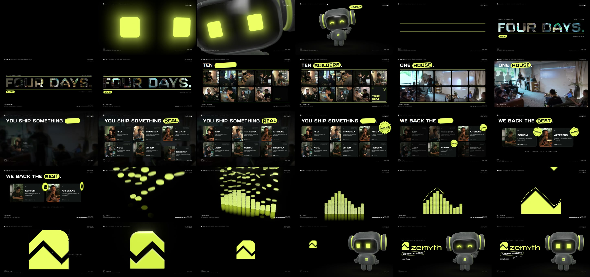

# Zemyth — a 30-second motion reel rendered in code

A 30-second, 1080p60 motion-design film for [Zemyth](https://zemyth.app) — the Hackerhouse builder
accelerator in Kuala Lumpur. Every frame is rendered by code (three.js, Canvas 2D, hand-written GLSL) and
the whole score and foley are synthesised by code (Web Audio). The only recorded media are the client's
own: documentary footage and photos from the house, and the Zembit's voice (ElevenLabs).


**Output:** `out/zemyth-reel-2026.mp4` (master) · `out/zemyth-reel-2026-web.mp4` (web)

## The story

16 bars at 128 BPM = exactly 30.000 s, one chapter every two bars. The Zembit — Zemyth's mascot — hosts:
we go *into* its eyes at the start and come back *out* of its visor at the end.

| Time | Chapter | What happens |
|---|---|---|
| 0–3.75 s | 01 Hello, world | Two lime eyes flicker on in the dark and glance around. The lights come up on a procedural 3D Zembit; it waves and says hello. The camera pushes into its visor and it blinks. |
| 3.75–7.5 s | 02 Four days | The closed eyes (pixel-exact from 3D) slide into one lime line, which opens like an eyelid onto the house: **FOUR DAYS.** rises on the spoken syllables, filled with the house's footage; a DAY counter ticks 01 → 04. |
| 7.5–11.25 s | 03 Ten builders | On the drop the lines spring apart into grid guides: ten seats — nine builders and a tenth, empty, lime: *your seat*. On "One house." the cards flip into a single video wall and open to full frame. |
| 11.25–15 s | 04 Ship it | The house steps back; the six real products of Hackerhouse 1.0 are dealt onto it. A lime scan passes over them. |
| 15–18.75 s | 05 Funded | Two are stamped **FUNDED** (Afferens, Schism — the two Zemu VC backed). The rest step back; the stamps turn over into coins and toss upward. |
| 18.75–22.5 s | 06 Funding | 357 glossy lime coins with the Z-peak struck in rain into twelve stacks tracing the logo's zig-zag; a dolly zoom flattens them into a bar chart with a trend line. |
| 22.5–26.25 s | 07 The mark | The stacks melt into the mark's base, the roof drops on: the chart line survives as the logo's negative space. Construction marks, then a glossy 3D spin that locks flat. |
| 26.25–30 s | 08 Signature | The mark is on the Zembit's visor: we pull back out, the mark flies into the lockup, **FUNDING BUILDERS**, `zemyth.app`. A wink; lights out; the eyes switch off last. |



## Run it

From the repo root (Node 22+, Google Chrome, ffmpeg, Python 3 with Pillow + numpy). The client's footage,
photos and licensed fonts are not in this repo; `prep_assets.sh` pulls them from a local checkout of the
Zemyth website (`ZEMYTH_UPLOADS` / `ZEMYTH_SITE` override the paths):

```bash
sh projects/zemyth/tools/prep_assets.sh                          # footage frames + photos → assets/ (git-ignored)
node projects/zemyth/render.mjs --stills=150,820,1700 --samples=1 # review stills → out/stills/
node projects/zemyth/render.mjs --samples=8 --workers=3          # final render → out/zemyth-reel-2026.mp4 (~5 min, M2 Pro)
python3 projects/zemyth/tools/check_frames.py projects/zemyth/out/zemyth-reel-2026.mp4
python3 projects/zemyth/tools/check_audio.py projects/zemyth/out/soundtrack.wav
```

Live preview: `python3 -m http.server 5173` at the repo root, then open
`http://localhost:5173/projects/zemyth/` and click to play.

Voice lines (only needed to regenerate them): `ELEVEN_API_KEY=… python3 projects/zemyth/tools/vo.py`, then
`python3 projects/zemyth/tools/vo_meta.py` (word timings via Scribe, key read from the macOS Keychain).

## Stack

| Layer | Tech |
|---|---|
| Character | A procedural Zembit: superquadric head, visor patch on the head surface, lathe headphones and torso, two-bone arms; speckled clay shader; SDF eyes on the visor (blink, saccades, happy arcs, the mark) |
| 3D | three.js: 357 instanced coins with analytic physics and a dolly zoom; an extruded, bevelled mark under an orthographic 1 unit = 1 px camera |
| 2D / type | Canvas 2D: footage-filled type, the headline + travelling keyword pill, cards, stamps, construction marks |
| Type | Refinery 95 Bold and Blender Pro (the client's `ZEMITH_Font_Family`), Inter (the brand book's secondary) |
| Audio | Web Audio `OfflineAudioContext`: score in F major, foley locked to the same score, the voice loudness-matched and ducked |
| Capture | Playwright + headless Chrome (GPU), 8-sample motion blur with sub-pixel jitter, FFV1 slices → H.264 bt709 + AAC |

## Credits and honesty

- **Brand**: palette, type, pills, cards and stickers follow the client's `BRAND.md` and moodboard; the
  mark and wordmark are the exact paths of `zemyth-mark.svg` / `zemyth-wordmark.svg`; logo drawn upright only.
- **The Zembit** is a code-built reconstruction of Zemyth's mascot, matched against `mascot-hero.png`.
- **Footage and photos** are Zemyth's own (Hackerhouse 1.0, KL) from the website repo. The six products,
  founders and "2 funded" are the site's published facts.
- **Voice**: ElevenLabs v3, premade voice "Jessica"; every line is the site's own copy.
- `projects/` is git-ignored: the client's fonts, photos and footage are not for publication.
- Designed, built, scored and rendered by Claude (Anthropic) in a Claude Code session. [`LEARNING.md`](LEARNING.md) is the playbook.
